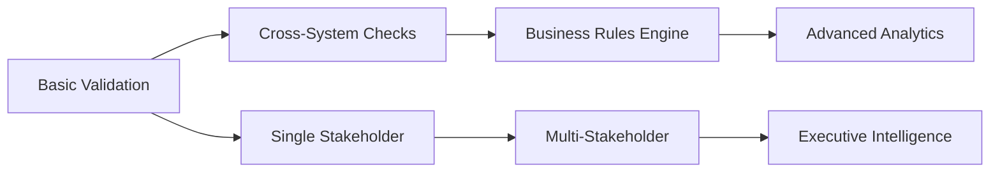

# 🎯 A Framework for Data Quality using Apache Airflow, SQL, and Python
### *Built in Higher Education, Designed for Any Industry*


> **An enterprise-grade, composable data quality monitoring framework that scales from simple validation checks to sophisticated multi-stakeholder business intelligence workflows. It is inspired by my appreciations for the cleverness of SQL stored procedures.**

**Quick Facts:** ⚡ Parallel validation engine • 📧 Industry-themed notifications • 🏗️ Modular architecture • 🔄 Progressive complexity • 🤖 AI-enhanced development

---

## 🌟 Why This Framework Matters

Data quality issues cost organizations **millions** on average. Data quality issues compound negatively through their effects on decision making across organizations as it becomes difficult to establish what a source of truth is. 
These effects multiply as 'bad' data makes it's way downstream to items like reports and dashboards impacting real operating workflows.

**This framework transforms reactive data firefighting into a proactive quality assurance system through composable design.**

Here are some of the highlights that I think make it useful immediately:

- **🏢 Cross-Industry Adaptability**: Retail inventory, operations compliance, financial reconciliation  
- **⚡ Progressive Implementation**: Start with basic checks, evolve to sophisticated business rules
- **📊 Executive Intelligence**: Multi-stakeholder reporting with business impact analysis
- **🎓 Production Ready for Higher Education**: Academic class codes, degree validation, financial holds

---

## 💡 Problem Statement & Solution

### The Challenge
Modern organizations struggle with:
- **Siloed Data Quality**: Manual, reactive approaches to data validation
- **Business Impact Blind Spots**: Technical alerts without business context
- **Scalability Barriers**: Point solutions that don't grow with complexity
- **Stakeholder Communication**: Generic alerts that don't drive action

### Our Solution
A **composable, industry-agnostic framework** that:

#### Higher Education Applications
- Validates student class codes align with degree programs
- Ensures degree consistency across admissions and registration
- Monitors financial holds and academic standing
- Automates compliance reporting for institutional research

#### Cross-Industry Adaptability
- **Retail**: Product catalog consistency, inventory level validation, supplier compliance
- **Manufacturing**: Equipment maintenance schedules, quality control metrics, safety compliance
- **Financial Services**: Transaction reconciliation, regulatory compliance, risk monitoring
- **Healthcare**: Patient data integrity, billing validation, regulatory compliance

---

## ✨ Key Features

### 🔧 **Composable Architecture**
- **Layer Validation Logic**: Start simple, add complexity progressively
- **Industry-Agnostic Design**: Swap SQL queries and business rules for any domain
- **Modular Components**: Mix and match validation checks as needed
- **Extensible Framework**: Build custom validation patterns on proven foundations

### ⚡ **Production-Grade Performance**
- **Parallel Processing**: Multiple validation checks run simultaneously
- **ACID Compliance**: Database operations with proper transaction management
- **Error Resilience**: Comprehensive error handling and graceful degradation
- **Observability**: Rich logging and monitoring throughout the pipeline

### 📧 **Intelligent Notifications**
- **Stakeholder-Specific**: Customized reports for different business audiences
- **Professional Theming**: Industry-appropriate email styling and branding
- **Business Impact Classification**: Automatic prioritization based on violation severity
- **Multi-Channel Support**: Email, webhooks, and integration APIs

### 📊 **Rich Reporting & Analytics**
- **Timestamped Violations**: Complete audit trail with CSV exports
- **Executive Dashboards**: High-level summaries for leadership
- **Trend Analysis**: Historical data quality metrics and patterns
- **Compliance Documentation**: Automated reporting for regulatory requirements

---

## 🚀 Quick Start Guide

### Installation

```bash
# Clone the repository
git clone https://github.com/teeeven/data-quality-airflow-framework.git
cd data-quality-airflow-framework

# Install dependencies
pip install -r requirements.txt

# Configure Airflow connections
# Set up your database connection in Airflow UI or via CLI
```

### Basic Configuration

```python
# Create your first validation check
@task(retries=0)
def check_inventory_levels():
    """Validate product inventory levels meet business rules"""
    results_df, violation_count = execute_data_quality_check(
        sql_file_path="inventory_validation.sql",
        conn_id="retail_database",
        check_name="inventory_levels"
    )
    
    csv_filepath = None
    if violation_count > 0:
        csv_filepath = save_results_to_csv(
            results_df, 
            "inventory_violations",
            "/usr/local/airflow/include/output/retail_quality"
        )
    
    return {
        "check_name": "Inventory Level Validation",
        "violation_count": violation_count,
        "csv_filepath": csv_filepath,
        "has_violations": violation_count > 0
    }
```

### Industry Adaptation Examples

#### Retail Use Case
```sql
-- inventory_validation.sql
SELECT 
    p.product_id,
    p.product_name,
    p.current_stock,
    p.minimum_threshold,
    p.category
FROM products p
WHERE p.current_stock < p.minimum_threshold
  AND p.status = 'ACTIVE'
  AND p.category NOT IN ('DISCONTINUED', 'SEASONAL_OUT')
```

#### Operations Use Case  
```sql
-- equipment_maintenance.sql
SELECT 
    e.equipment_id,
    e.equipment_name,
    e.last_maintenance_date,
    e.next_maintenance_due,
    DATEDIFF(DAY, GETDATE(), e.next_maintenance_due) as days_overdue
FROM equipment e
WHERE e.next_maintenance_due < GETDATE()
  AND e.status = 'ACTIVE'
  AND e.maintenance_required = 1
```

---

## 🏗️ Architecture Deep Dive

### Core Components

```
┌─────────────────┐    ┌──────────────────┐    ┌─────────────────┐
│   SQL Queries   │    │  Validation      │    │  Notification   │
│   (Industry     │───▶│  Engine          │───▶│  Router         │
│   Specific)     │    │  (Universal)     │    │  (Stakeholder)  │
└─────────────────┘    └──────────────────┘    └─────────────────┘
         │                        │                        │
         ▼                        ▼                        ▼
┌─────────────────┐    ┌──────────────────┐    ┌─────────────────┐
│ Business Rules  │    │ Results          │    │ Email Themes    │
│ Configuration   │    │ Aggregation      │    │ & Templates     │
└─────────────────┘    └──────────────────┘    └─────────────────┘
```

### Composability Patterns

#### **Progressive Complexity**
1. **Basic Validation**: Single table, simple business rules
2. **Cross-System Validation**: Multiple data sources, referential integrity
3. **Business Logic Integration**: Complex rules, stakeholder-specific alerts
4. **Advanced Analytics**: Trend analysis, predictive quality metrics

#### **Industry Extension Points**
- **SQL Templates**: Domain-specific query patterns
- **Business Rules Engine**: Configurable validation logic
- **Notification Themes**: Industry-appropriate styling and terminology
- **Stakeholder Mapping**: Role-based alert routing

---

## 🎯 Real-World Examples

### Higher Education Implementation
```python
# Academic validation pipeline
class_codes_check = check_class_codes()           # Degree program alignment
degree_consistency = check_degree_consistency()   # Cross-system validation
financial_holds = check_financial_holds()         # Compliance monitoring

# Stakeholder notifications
registrar_notification(academic_issues)
financial_aid_alert(financial_violations)
executive_summary(high_impact_issues)
```

### Retail Adaptation
```python
# Inventory validation pipeline  
inventory_levels = check_inventory_levels()       # Stock thresholds
product_catalog = validate_product_catalog()     # Data consistency
supplier_compliance = check_supplier_sla()       # Business rules

# Stakeholder notifications
operations_alert(inventory_violations)
procurement_notification(supplier_issues)
executive_dashboard(business_impact)
```

### Operations Implementation
```python
# Equipment monitoring pipeline
maintenance_schedules = check_maintenance_due()   # Preventive maintenance
safety_compliance = validate_safety_protocols()  # Regulatory compliance
performance_metrics = check_equipment_kpis()     # Operational efficiency

# Stakeholder notifications
maintenance_team_alert(overdue_equipment)
safety_officer_notification(compliance_issues)
operations_director_summary(performance_trends)
```

---

## 📈 Advanced Features

### Multi-Stakeholder Intelligence

The framework automatically routes notifications based on business impact and stakeholder roles:

```python
# Business impact classification
if high_impact_violations > 25:
    send_executive_alert()
    
if financial_compliance_issues > 0:
    notify_financial_team()
    
if operational_issues > threshold:
    escalate_to_operations_manager()
```

### Progressive Implementation Strategy



---

## 🤖 Development Methodology

### AI-Enhanced Development

In this project, I used Claude Code as a pair programmer to validate a test-driven approach to development.
With this, utilities are made in a validate-first behavioral style.
This is intentional and fosters a defensive programming style which I find valuable.

- **🧠 Claude Code Integration**: Leveraged AI assistance for rapid prototyping and code generation
- **👨‍💻 Human Oversight**: All business logic, architecture decisions, and quality standards maintained by human expertise
- **⚡ Productivity Multiplication**: AI tools accelerated development while preserving high code quality
- **🔍 Transparent Approach**: This level of transparency is reflective of my core principle of observability.

---

## 🛠️ Technical Implementation

### Production Features
- **Error Handling**: Comprehensive exception management with contextual logging
- **Transaction Management**: ACID-compliant database operations
- **Monitoring**: Built-in observability with structured logging
- **Testing**: Unit and integration test patterns included
- **Documentation**: Extensive inline documentation and configuration examples

### Code Quality
- **Type Hints**: Full type annotation for better IDE support and maintainability
- **Modular Design**: Clear separation of concerns with reusable components
- **Configuration Management**: Environment-specific settings and deployment patterns
- **Security**: Best practices for credential management and SQL injection prevention

---

## 🚀 Getting Started for Different Industries

### For Higher Education Institutions
1. Review the included academic validation examples
2. Configure your SIS database connections
3. Customize degree program mappings
4. Set up institutional email themes
5. Deploy with academic calendar scheduling

### For Retail Organizations
1. Adapt SQL queries for inventory and product data
2. Configure supplier and warehouse data sources  
3. Customize business rules for inventory thresholds
4. Set up operations team notifications
5. Implement with daily/hourly monitoring schedules

### For Operations Teams
1. Modify validation checks for equipment and safety data
2. Configure maintenance and compliance databases
3. Adapt business rules for operational KPIs
4. Set up multi-team notification routing
5. Deploy with real-time monitoring capabilities

---

## 📚 Documentation & Examples

### Included Templates
- **SQL Query Templates**: Industry-specific validation patterns
- **Configuration Examples**: Multi-environment setup guides
- **Email Themes**: Professional notification styling
- **DAG Patterns**: Advanced orchestration examples
- **Testing Frameworks**: Unit and integration test templates

### Extension Guides
- **Custom Validation Logic**: Building domain-specific checks
- **Notification Routing**: Multi-stakeholder alert strategies  
- **Business Rules Integration**: Configurable validation parameters
- **Performance Optimization**: Scaling for large datasets

---

## 🤝 Contributing & Portfolio

### Project Vision
This framework represents a **production-ready, industry-agnostic solution** to data quality challenges. It demonstrates:

- **Systems Thinking**: Understanding of complex data ecosystems
- **Business Acumen**: Translation of technical capabilities into business value
- **Scalable Architecture**: Design patterns that grow with organizational needs
- **Modern Development Practices**: AI-enhanced productivity with human expertise

### How to Contribute
1. **Fork the repository** and create a feature branch
2. **Add industry-specific examples** or validation patterns
3. **Submit pull requests** with clear documentation
4. **Share use cases** from your domain or industry
5. **Report issues** and suggest improvements

### Professional Contact
- **LinkedIn**: [https://www.linkedin.com/in/steven-orizaga/]
- **GitHub**: [(https://github.com/teeeven)]  
- **Email**: [stevenorizaga@gmail.com]

---

## 📄 License

This project is licensed under the MIT License - see the [LICENSE](LICENSE) file for details.

## 🙏 Acknowledgments
- **My collegue and mentor, Zuma**: For inspiring the initial use cases having me help debug stored procedures
- **Apache Airflow Community**: For the robust orchestration platform
- **Claude Code by Anthropic**: AI-assisted development that accelerated this project

---
